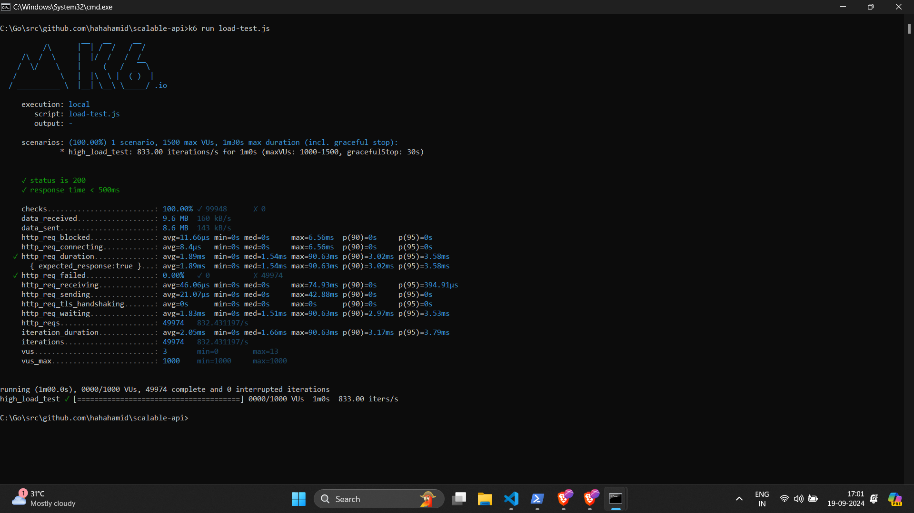

# Scalable API Performance Testing

### 🚀 Testing the Scalability of a Go API under High Load Conditions

This repository contains a Go-based API and a comprehensive performance testing setup using `k6`. The goal is to determine the API's capability to handle high traffic loads, with a focus on scalability and optimization.


## 🌟 Overview

APIs are the backbone of modern applications, but how do you know if your API is scalable? This project demonstrates how to test a Go API for high-load performance using `k6`. We set out to achieve 10K, 50K, and even 100K requests per minute, optimizing and fine-tuning along the way.

## 🛠 Setup

### Prerequisites
- [Go 1.18+](https://golang.org/dl/)
- [k6](https://k6.io/docs/getting-started/installation/) for load testing

### Installation

1. Clone the repository:
    ```bash
    git clone https://github.com/hahahamid/scalable-api-performance-testing.git
    cd scalable-api-performance-testing
    ```

2. Set up the Go API:
    ```bash
    go mod tidy
    go run cmd/main.go
    ```

## 📊 Results
### The API successfully handled the following loads:

- 10K Requests per Minute: Low latency, 0% errors.
- 50K Requests per Minute: Consistent performance, average response time: 1.89ms, 0% errors.
- 100K Requests per Minute: [Future testing...]

## 🔍 Conclusion
This project demonstrates the importance of performance testing in API development. With proper architecture and optimizations, it is possible to build highly scalable APIs capable of handling significant traffic loads.

